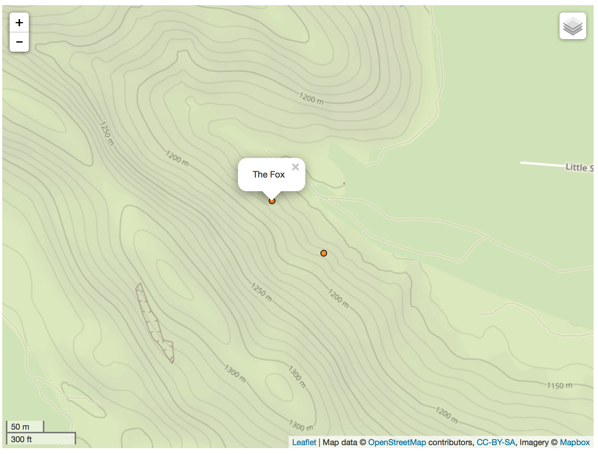

Simple app illustrating [geojson](https://en.wikipedia.org/wiki/GeoJSON) data format and [Leaflet.js](http://leafletjs.com) mapping library.

How to run (node.js required)
```
# git clone https://github.com/openbeta-io/geojson-poc.git
# cd geojson-poc
# npm install
# node app.js
```
View the app in your browser at http://localhost:8080 

Live [demo!](http://demo-openbeta1.rhcloud.com)

Screenshot

